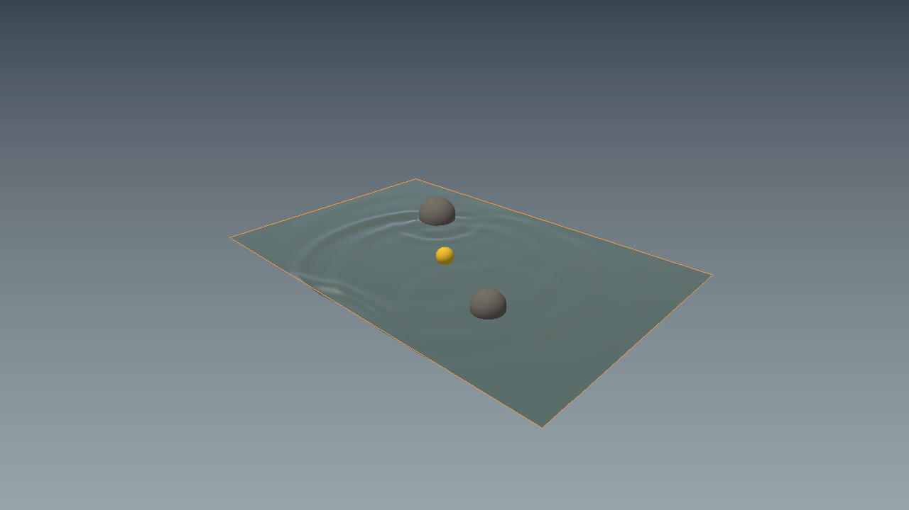
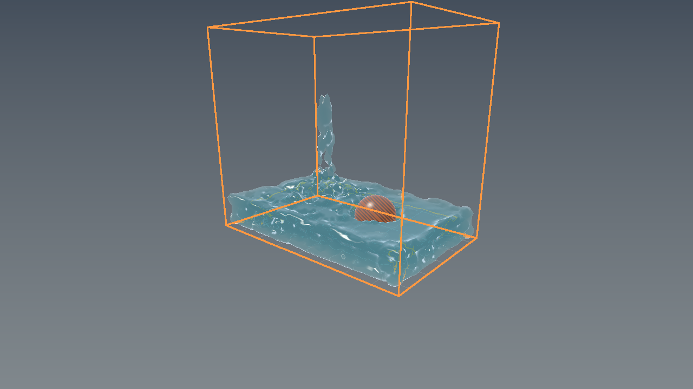

# Water integration and quality review

Date: 2026-09-25. **Verdict: useful research prototype; not production-ready water.** Ripple is the more practical starting point for broad, calm water surfaces. Flux is useful for small-basin experiments, but its current CPU mesh extraction is far too slow for live engine geometry on the measured machine.

## Import and exact integration scope

Imported `Projects/Project-Fluid` from `SultanAladin/Frontier-`, branch `arena/01a0c575-frontier`, **6d230bb3406f7e574c07a8a4cc4df87942a914b7**. No upstream engine files or exhibit bundle replaced the newer consolidated engine. Original README, PAPER_FIDELITY, RESEARCH, shaders, Web experiment and notices are retained. This is a selective source import, not a merge of the entire upstream history.

Included:
- **Flux:** CPU position-based particle fluid, boundary sampling, viscosity presets/PCG, covariance/PCA surface kernels and marching-cubes mesh extraction.
- **Ripple:** damped height-field waves, fixed rock masks, lightweight body/wake interaction and CPU proof renderer.
- Optional standalone Vulkan projected-particle renderer, and the separate WebGL2 NearShore experiment.
- **New native bridge:** `Projects/Project-Zero/Source/WaterBodySequence.*` converts Ripple heights/normals into the actual `GeometryStructure`, registers a material, mesh instances and a named scene placement. Y-up is rotated into Frontier Z-up. Integration occurs before acceleration construction and GPU upload, through the normal scene-loading path. Both CMake and the direct Windows source list include it.

**This bridge is a load-time snapshot, not live simulation.** It uses the ordinary mesh picking/material-inspector path; no dedicated water entity inspector, adjustable wave controls, time-step scheduling, dynamic GPU vertex/BLAS updates, wind coupling or scene-codec serialization for simulation settings has been added. Interactive selection and appearance have not been verified in the Windows viewport. The CPU bridge test verifies native scene records, not UI behavior.

The material has IOR 1.333, roughness 0.035 and transmission weight 1. It is explicitly a **thin-walled sheet**, not a closed refractive volume. Default dimensions are 12 × 8 metres at Z=0.2; the scene's existing floor may obscure it depending on scene layout. Solver rock masks create approximate holes; corresponding rock meshes are not added by this bridge. Those rocks/body shown in the standalone pond proof belong to that separate demo.

## Build and run

CPU path needs CMake 3.21+, Ninja and a C++20 compiler; no downloaded dependencies or GPU SDK:

```sh
cmake --preset fluid-cpu
cmake --build --preset fluid-cpu
ctest --preset fluid-cpu
```

From a Visual Studio x64 developer terminal this also builds the CPU targets with MSVC; **MSVC execution of the newly imported targets remains unverified here**. On Windows, add `.exe` to executable names below.

```sh
build/fluid-cpu/Projects/Project-Fluid/Project-Fluid-Benchmark
build/fluid-cpu/Projects/Project-Fluid/Project-Fluid-CPU build/fluid-cpu/flux.ppm 90 water
build/fluid-cpu/Projects/Project-Fluid/Project-Fluid-Pond-CPU build/fluid-cpu/pond.ppm clean
```

To use the native snapshot, rebuild the existing Windows application normally, then run from repository root:

```powershell
.\Projects\Project-Zero\Build\ToolchainSequence.ps1
.\Build\Project-Zero.exe --water-body-snapshot
```

Do not confuse the CPU test preset with building the full application. Full Windows/Vulkan build and runtime were not executed for this water change.

The standalone fluid project also configures with `cmake -S Projects/Project-Fluid -B build/fluid-standalone -G Ninja`. Add `-DFRONTIER_BUILD_PROJECT_FLUID_VULKAN=ON` to explicitly request the Vulkan window. It requires a Vulkan SDK, glslc/slangc and GLFW; missing requirements now produce a configuration error instead of silently dropping a requested target. Managed GLFW is reused when available. This option does not turn Project-Zero's snapshot into live water.

## Changes made during integration

1. Added native snapshot bridge, CLI flag, root CPU preset and matching application build-source lists.
2. Corrected mesh-cache invalidation: rotation, minor-axis changes, weight changes and arbitrarily small centre movement now invalidate affected bricks. Previously these could leave stale geometry indefinitely. Unchanged inputs skip assembly/smoothing altogether.
3. Added pond dimension guards: finite extents in [0.01, 10000] metres, at least three samples per axis, maximum 160000 cells. Invalid disturbance radius/nonfinite inputs are rejected. This is not exhaustive validation of every public fluid API.
4. Added scene-bridge and regression tests plus a reproducible stage benchmark. The regression test compiled against the untouched import **fails at rotation invalidation**; the fixed version passes.
5. Retained attribution and included the full MIT text for the Three.js-derived lookup tables. This does not grant a licence for the entire upstream project; see root NOTICE.

## Verification performed

Linux, GCC 12.2.0, C++20:
- **5/5 Release CTests passed**, 5.12 seconds total: CPU PBF smoke, deterministic watertight surface, pond dynamics, native scene bridge, cache/input regression.
- **5/5 standalone Debug CTests passed under UndefinedBehaviorSanitizer**, 39.83 seconds total (`-fsanitize=undefined -fno-sanitize-recover=all`). Not an AddressSanitizer run.
- GameExecution.cpp syntax-check passed against installed dependency headers and the repository's GLFW header counterpart. No full application link or GPU execution implied.
- Build-source parity gate passed: 100 CMake Project-Zero translation units, all present in the 105-entry direct Windows batch; existing project parity checks remained green.
- Actual CPU proof frames generated for water, honey and pond; no generated/AI artwork used. These are **standalone CPU demo captures, not Project-Zero Vulkan screenshots**.
- Scene-bridge checks cover nonempty geometry, placement/material registration, IOR/thin-wall settings, axis mapping, triangle winding, normals, index validity, refusal to append over existing geometry and solver height changes reaching the mesh.





The pond shows readable concentric waves but simplistic lighting and composition. Flux shows a coherent surface and pouring stream, but lumpy silhouettes and an overly glassy/metallic-looking presentation. These proofs demonstrate geometry and solver behavior, not photorealistic physically complete water transport.

## Measured performance — one machine, not a hardware guarantee

Release `-O3`, sandbox exposing two CPUs, Intel Xeon @ 2.60 GHz. Single benchmark run, no statistical confidence interval; values depend on state and hardware. [Raw stage measurements](FluidEvidence/benchmark.txt), [proof execution logs](FluidEvidence/Execution.json).

| Stage | Measured time | Interpretation |
|---|---:|---|
| Flux step, 1440 particles | 30.97 ms average over 60 steps | Already exceeds a 16.7 ms / 60 Hz whole-frame budget before rendering |
| PCA reconstruction | 6.90 ms average over 10 repeats | Additional CPU work, separate from solver |
| Initial mesh extraction | 3821 ms | Seconds, not an interactive frame |
| Changed-frame extraction | 2565 ms; 192 dirty bricks | Primary obstacle to live reconstructed mesh use |
| Unchanged extraction | 0.0128 ms average over 100 repeats | Fixed cache is cheap only when input actually stays unchanged |
| Ripple, 13824 cells | 0.196 ms average over 360 steps | Promising CPU surface-wave cost, excluding mesh upload/render |

The 90-step/1.5-second water proof used 1620 particles, produced 32984 triangles and reported zero open/nonmanifold edges for that state. Mean/peak compression diagnostics were 0.00245/0.02244. The corresponding honey run reported 15 PCG iterations and approximately 0.00001 relative residual. End-to-end proof runs were approximately 7.58 seconds each, including simulation, reconstruction, mesh extraction, rendering and output; **these are not isolated render times or FPS**.

## Quality and remaining problems

### Strengths
- Real implementations rather than UI-only placeholders: particle constraints, sampled boundaries, implicit viscosity and covariance reconstruction are present.
- Multiple solver/material experiments with testable native CPU paths, not just a browser demo.
- Ripple's CFL-checked time integration and damping tests are a reasonable foundation for mild pond disturbances.
- Geometry extraction and solver work are sufficiently separated to replace bottlenecks without rewriting every component.

### Production blockers / limitations
1. **Scaling:** particle neighbours are all-pairs O(N²), with capped neighbour storage; reconstruction also scans particle pairs. Dirty field samples scan the kernels. Add a spatial hash/grid and brick-to-kernel indexing before increasing particle count.
2. **Finite extraction domain:** current 65 × 48 × 45 grid at spacing 0.07 covers Y only to 3.13, while particle bounds extend to Y=3.70. High particles/surfaces can be clipped. This remains unfixed; one watertight test state is not a universal guarantee.
3. **Physics fidelity:** presets are not SI-calibrated material validation. Limited pressure iterations do not establish divergence-free incompressibility. Lightweight body/wake interaction is not equal-and-opposite rigid/fluid pressure coupling.
4. **Ripple is 2.5D:** one height per horizontal point, reflective rectangle and fixed masks. No overturning waves, breaking surf, splashes or full shallow-water mass/momentum model. Frame-time caps intentionally drop excess simulation time.
5. **Rendering is incomplete:** the standalone Vulkan view projects particle depth/thickness; it does not ray-trace the extracted mesh. Closed volumes, correct entry/exit refraction, scattering, caustics and matching path-traced validation remain work. The native snapshot material does not solve those omissions.
6. **GPU robustness unproven:** Vulkan device/queue selection and swapchain format/usage assumptions need capability checks and fallback/error paths. No NVIDIA/AMD/Intel runtime matrix was run. Shader/compiler and resize/runtime compatibility are unverified.
7. **Editor integration is early:** no live water authoring/inspector loop or native viewport capture verified in this change. A selectable standard mesh is not equivalent to a complete editable water system.
8. **Web experiment is separate:** NearShore's WebGL2 wet/dry and foam work has not been ported to the engine's Vulkan path.

## Recommended order of next work

1. Turn Ripple into a persistent water component with genuine inspector parameters, live height/normal buffer updates and picking/outliner verification in the native viewport.
2. Add shoreline/bottom/obstacle geometry and correct scene-depth/refraction handling, with explicit thin-sheet versus closed-volume modes.
3. Spatially index Flux neighbours and extraction kernels; fix extraction bounds and establish correctness/performance regressions across moving states.
4. Validate rigid-body coupling and physical calibration; then add splashes/foam and cross-vendor Vulkan validation.

**Recommendation:** keep both implementations, prioritize Ripple for usable broad water, and treat Flux as a small-scale research backend until its measured extraction bottleneck is addressed. Do not advertise this import as finished photorealistic, physically accurate, live engine water.
