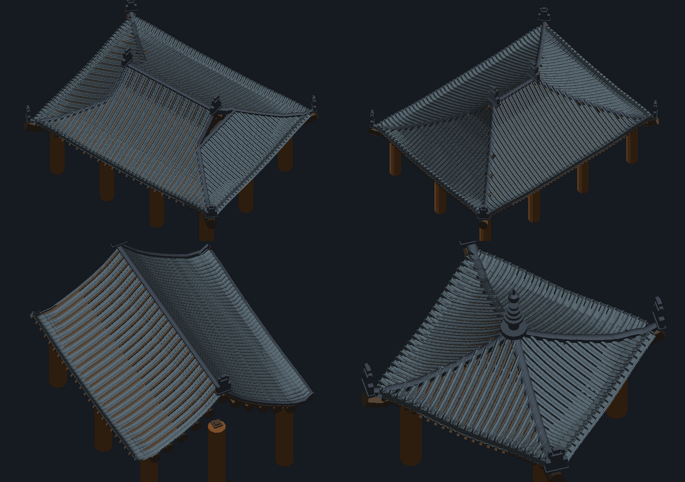

# Frontier — Procedural East-Asian Building Generator

Blender-Geometry-Nodes-style **procedural generator for ancient East-Asian
buildings with modern styling** — every building generated from parameters, never
a fixed asset.

Work is staged, and **the roof comes first**: it is the hardest and most
characteristic part, and everything else has to sit under it.

```bash
npm install
npm run dev        # → interactive viewer at http://localhost:5173
npm run build
npm test           # headless geometry verification, exit code = pass/fail
npm run verify     # the app's own 119-scenario sweep
```

There are two subsystems in the tree right now, and they meet at the roof:

| | what it is | where |
|---|---|---|
| **Interactive app** | React + three.js viewer, control panel, `.GLB` / JSON export, lantern generator, night mode | `src/App.tsx`, `src/components/`, `src/lib/` |
| **Geometry kernel** | The roof computed from first principles — 舉折 profile, height field, tiles, timber, ridges — with a 20-check verifier that re-derives every placement | `src/core/`, `src/gen/` |

The kernel is the load-bearing piece: it is the one that *proves* the geometry
rather than drawing something that looks right. `src/gen/README`-level notes are
in the section below; unifying the app's viewer onto the kernel is the next step
(tracked at the bottom of this file).

---

## The geometry kernel

*Yingzao Fashi* 舉折 profile, a min-over-faces height field, and a verifier that
re-derives every placement from scratch.

```
src/core/juzhe.ts    舉折 — the Song-dynasty profile rule. Purlin heights drop
                     H0/10, then halve each step. Single source of truth for the
                     roof's SHAPE.

src/gen/roofField.ts The height field s(x,z) = min over faces of (perpendicular
                     distance from that face's eave ÷ its depth). Taking the MIN
                     makes a hip the exact intersection of two faces and the
                     ridge exactly level — nothing floats, nothing crosses.
                     Everything else reads its position back out of this field.

src/gen/tileKit.ts   Tile and ornament solids: 板瓦, 筒瓦, 瓦當, 滴水, 脊瓦, 鴟吻.

src/gen/tiles.ts     Tile course layout. 壓六露四 overlap, columns on a pitch,
                     hip tiles cut to the hip line.

src/gen/frame.ts     The structural core: 椽 rafters purlin-to-purlin, 飛椽 flying
                     rafters carrying the concave eave, 檩 purlins on the 舉折
                     line, 角梁 hip rafters, 望板 sheathing whose top face IS the
                     tile bedding plane, 柱 columns, 斗拱 brackets.

src/gen/ridges.ts    脊瓦 on every ridge run, with 正吻 / 鬼瓦 / 寶頂.

src/gen/verify.ts    20 geometric checks — the acceptance test.

src/gen/index.ts     generateRoof(request) → { field, tiles, frame, ridges, geometries }
```

### The no-float contract

Everything is placed by reading back **from** the surface, never by adding up
heights, and `src/gen/verify.ts` re-derives each of these independently:

1. rafters run purlin to purlin and their tops meet the sheathing's underside;
2. purlin tops lie exactly on the 舉折 profile;
3. the sheathing's top face is exactly the tile bedding plane;
4. 板瓦 bed on a 灰漿 layer above that plane and 筒瓦 crown on the pans;
5. 脊瓦 rims reach down to the 筒瓦 crowns either side, so a ridge straddles its
   tiles instead of hovering;
6. columns top out exactly under the eave purlin.

Two datums are deliberately kept apart: `yAt()` is the **tile bedding plane**
(the 舉折 line offset along its own normal by the rafter + sheathing stack), and
`timberY()` is the **structural 舉折 line** that purlins and columns sit on.

### One kernel, two label sets

`roofType` picks geometry. `style` (`chinese` | `japanese`) changes only naming,
tile defaults and ornament set — never the geometry kernel.

### Verification is the point

All 20 checks pass on all four roof types, most at machine precision (tile ends
on the bedding plane: 4e-16 m). The checks that carry real tolerance are the
honest ones — a rigid tile bridging a concave eave, or a 脊瓦 chording the 翼角
sweep.

`npm run shot` renders the four forms through a software rasteriser
(`test/shot.ts`) into `roof.bmp`, so the geometry can be *looked at* from a
headless run. Verification proves it is right; that proves it is a roof.

---

## The app — Phase 1 / 1b



**Styles** — the four canonical types shared by Japan, China and Korea:

| Style | JP | CN / KR | Form |
|---|---|---|---|
| Kirizuma | 切妻造 | 悬山/硬山 · matbae | gabled, 2 slopes + gable walls |
| Yosemune | 寄棟造 | 庑殿 · udjin-gak | hipped, 4 slopes, 45° plan hips (equal pitch) |
| Irimoya | 入母屋造 | 歇山 · paljak | hip-and-gable: upper gable roof astride a lower hip roof |
| Hōgyō | 宝形造 | 攒尖 | pyramidal, 4 hips meet at an apex + finial |

**Tiles**: hongawara-buki 本瓦葺 (concave hiragawara + half-round marugawara +
round nokigawara eave caps), sangawara-buki 桟瓦葺 S-pantiles, and modern flat
interlocking panels for 和モダン styling. Real kawara module (270 mm / 225 mm
exposure).

**Curvature**: concave sorimashi profile (nawadarumi slack-rope approximation),
curled hip rafters (sori), eave corner upturn (反り / jiaoqiao / cheoma).

**Structure**: round taruki rafters at 455 mm pitch, wall plates, mid purlins,
ridge beam (munagi), tie beam + king post, bargeboards (straight or karahafu
ogee), kirikomi flashing, onigawara demon tiles, hōju apex finial.

**Verification** (live panel, and headless via `npm run verify`): eave overhang,
pitch range, curvature, eave height, tile coverage, hip closure — and a
**connectivity check** proving every part touches the ground → plinth → walls →
roof chain.

**Ornaments** (Phase 1b): Chinese ornament pack — chiwen 螭吻 ridge-end beasts
that "swallow" the ridge, wenshou hip beasts in rank-coded odd numbers (3–9 per
hip), dougong-style painted bracket sets, imperial orange/yellow glaze swatches.
Japanese onigawara retained as the JP option.

**Lantern generator**: 3 independent groups, each with 25 procedural designs in
3 mount categories (Hanging / Standing / Stone-&-cement garden) — tube, round
and square chōchin 筒/丸/角提灯, andon 行灯, tall kiriko 切子, hexagonal bonbori
雪洞, palace lantern 宫灯, spinning carousel 走马灯, Korean cheongsachorong
청사초롱, paper globe 明かり, stone tōrō 石灯籠, Kasuga tōrō 春日灯籠, yukimi, oribe (moon windows), oki, hanging tsuri, pagoda, concrete bollard, disc, melon, barrel, gourd, hex-palace, diamond and roof-top hanging lanterns (all with swaying tassels). Each group: count, size, glow, paper/frame colours, **custom characters
drawn vertically on the paper**, optional point lights. Night mode shows them off.
**Entrance**: raised-floor platform with stone/timber steps (IRC rise/run) and/or a 1:6–1:12 access ramp (ADA), handrails both sides, entry door slab.

**Export**: any roof as `.GLB` (imports straight into Blender) or as `.JSON`
parameters.

## Research

`docs/roof-research.md` is the authoritative reference behind the kernel: Chinese
and Japanese roof taxonomy, the 舉折 algorithm with its closed form and worked
example, eave and flying-rafter construction, corner pad blocks, the height-field
method, the 入母屋 break line, and the tile system with overlaps and glaze rank.
Ten sources.

Further sources for the app layer: roof types kirizuma / yosemune / irimoya /
hōgyō — adayofzen.com, meguri-japan.com, note.com/kominkanist · hongawara
construction and ~104 kg/m² — gov-online.go.jp (Nihongawara), isaackremer.com ·
onigawara dimensions (~28 cm) — Japan Antique Roadshow · sori and the nawadarumi
curve — thecarpentryway.blog, engineerfix.com · juzhe, flying rafters, corner
upturn — MDPI Buildings 2025 · CN roof hierarchy and parametric rules — Shen et
al. · chiwen / hip beasts / dougong — pgm.org.cn, ibiblio.org, baike.baidu ·
chōchin forms, bonbori, zou-ma-deng, cheongsachorong, kasuga-dōrō —
hayakawajunpei, skdesu.com, baike.baidu (Revolving Lanterns), paper-capers,
magicstonegarden · oribe moon windows & oki/tsuri types — enwik.org (Tōrō), kamisenro.co.jp · concrete pagoda lanterns — Athena Garden · hanging tassels (fangshui) & ribbed profiles — Chinese festival-lantern reference sketches · entry steps — IRC R311.7 · ramps — ADA §405 · stone stairs — Shinto architecture.

## Roadmap

- **Now** — unify: point the app's viewer at the verified kernel
  (`generateRoof`), so there is one roof implementation rather than two, and the
  live panel's numbers come from `src/gen/verify.ts`.
- **Phase 2** — Walls, floors, building types (machiya / store / office …)
- **Phase 3** — Openings, lattices, noren & signboards (custom text)
- **Phase 4** — Lights (types), utility poles & wiring, electricity hookup
- **Phase 5** — Furniture & street props (all Asian-style, all optional)
