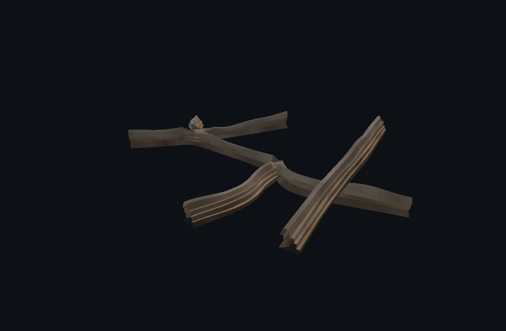
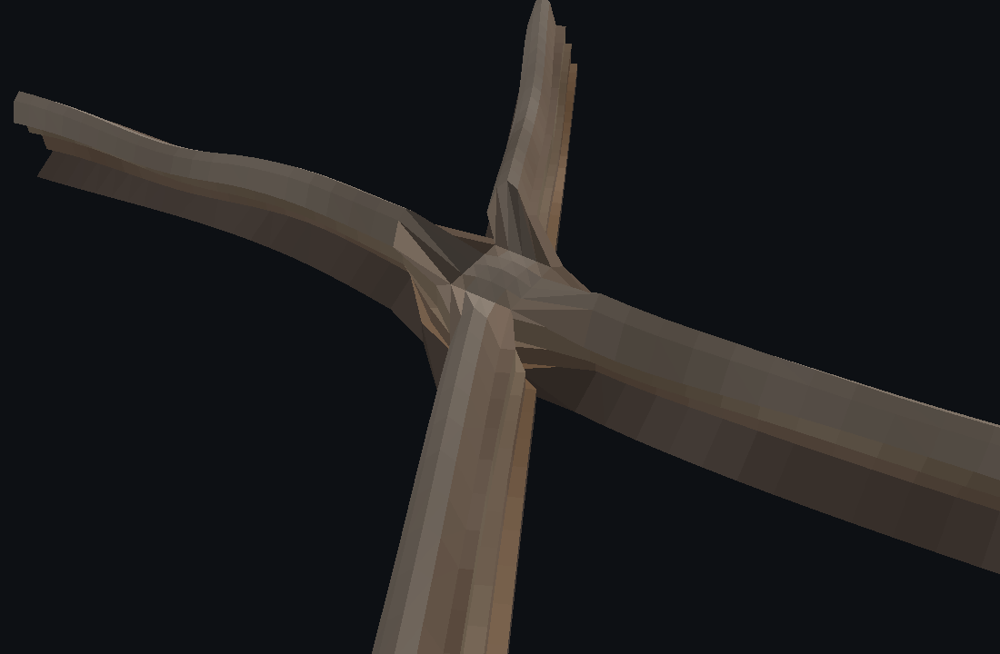
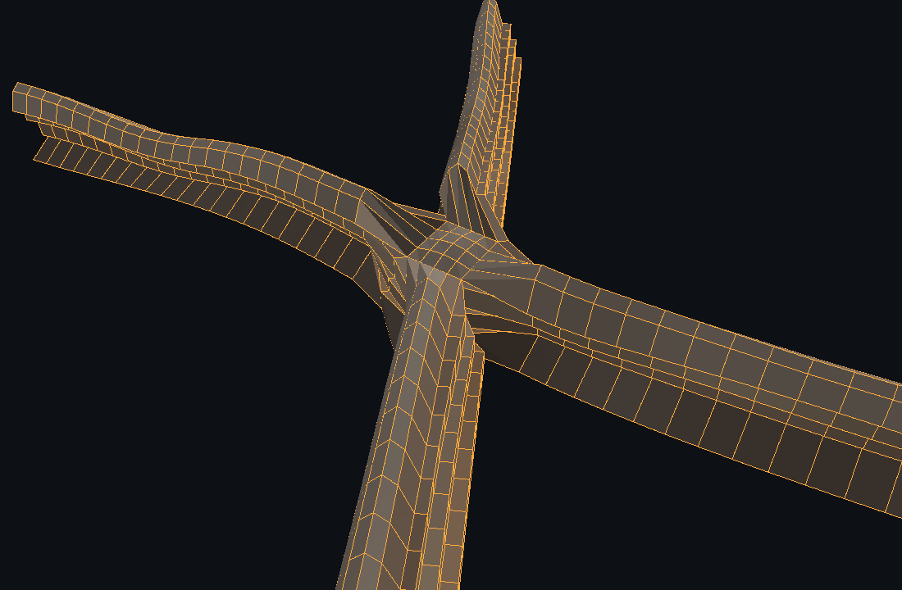
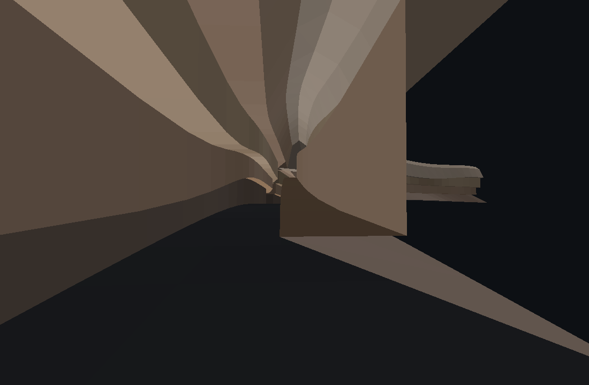
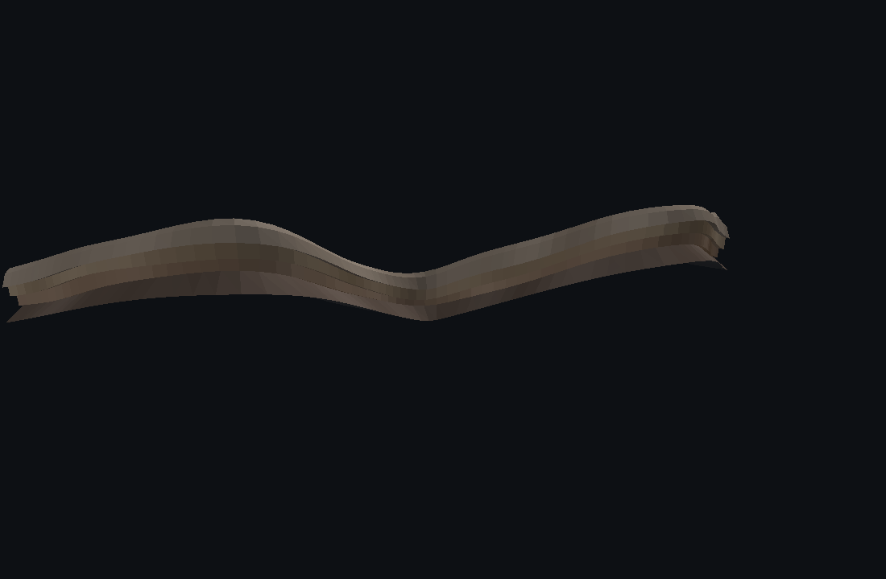

# Frontier — Procedural Tunnel Generator

Draw splines in 3D, get a **procedural tunnel / pathway network** as **one
connected, all-quad mesh** — flat road decks, tiered procedural walls
(different levels), arched vaults whose height varies, and true **X / Y / T
junctions** where the splines cross or branch.

<p align="center">
  
</p>

| X / Y junctions, clean quad flow | Quad topology through the junction |
|---|---|
|  |  |

| Inside the tunnel (flat road, tiered walls, varying vault) | Hills — height varies along the path |
|---|---|
|  |  |

## Run

```bash
npm install
npm run dev        # http://localhost:5173
```

`npm run check` — headless verification of the mesh core (all-quad faces,
shared-vertex seams, crack-free edges, junction stitching).  
`node tools/render.mjs` — software-rasterises the docs images.

## What it does

- **Spline paths** — centripetal Catmull-Rom curves, edited as control points.
  Height varies freely along a path (the tunnel is *not* flat).
- **Flat roads** — every cross-section is cut horizontally: the road deck stays
  flat across the section and simply follows the spline's elevation.
- **Procedural walls with different levels** — each wall is a stack of
  riser/ledge tiers (1–5), with world-space noise varying tier heights, ledge
  depths and vault rise along the length. Strata colours follow the tiers.
- **Varying tunnel height** — the vault rise is noise-driven per station; paths
  can climb and dive.
- **X / Y / T junctions** — when splines cross at similar heights they are
  stitched into a real junction chamber (floor patch + strips + chamber walls +
  vaulted ceiling). Splines crossing at *different* heights become overpasses
  (no merge — the network reports N separate shells).
- **One mesh, one topology** — arms and junction chambers share vertices at
  every seam. Verified: zero duplicate positions, exactly-1 connected component
  for stitched networks, and no edge is ever shared by 3+ faces (crack-free;
  the only borders are open tunnel portals).
- **Clean quads everywhere** — road strips, tiered walls, vault arcs, junction
  floors, chamber walls and ceilings are 100% quads. The wireframe overlay draws
  quad edges only (no triangle diagonals).
- **OBJ export with quad faces** — `f a b c d` comes out intact for
  Blender / Maya / Houdini (`vertex colours` included, `v x y z r g b`).

## Editor

- **Click** ground — add a control point to the active spline
- **Drag ●** — move a point (XZ) · **Shift+drag** — change height
- **Del** — remove the selected point (or the whole spline if it drops below 2 points)
- **+ Spline / − Spline / Clear** — manage paths
- Live parameters: road width, wall tiers / heights / ledges / noise, arch rise
  & height variation, station spacing, detail, seed
- Stats panel shows vertices / quads / arms / junctions / overpasses and a
  topology badge (`✓ one connected topology` when the network stitches into a
  single shell)

Presets: **Full network** (X + Y + overpass + hills), **X crossing**,
**Y junction**, **Overpass**, **Hills**, **Custom**.

## How the junction stitch works

Each path is swept as a closed profile loop —
`road rows → right wall tiers (up) → vault arc → left wall tiers (down)` —
with a fixed index layout, so rings always agree:

```
roadIds [Lm…Rm] · rwallBottomUp [Rm…RTop] · arcIds [RTop…LTop] · lwallBottomUp [Lm…LTop]
```

At a junction, every arm opens through a *mouth ring*; the chamber re-uses those
ring seams as-is (shared vertex ids, not welded copies):

- **floor**: square Coons patch + one quad strip per mouth (road seam → patch)
- **walls**: a walk of columns around the chamber — mouth columns are the arm's
  own wall seams, corner/back columns are new — with the same tiered profile
- **ceiling**: square Coons patch + one strip per mouth (vault seam → patch),
  domed toward the centre

All quad-only, all shared-vertex — the four arms of an X literally flow into one
continuous quad grid (see the wireframe shot above).

## Repository layout

```
src/core/          pure-JS mesh core (no three.js dependency)
  spline.js        centripetal Catmull-Rom, arc-length resampling, projection
  profile.js       cross-section builder (road / tiered walls / vault), noise
  network.js       junction detection (crossings, end-touch), arm splitting
  generate.js      arm sweeps + junction chambers -> one indexed quad mesh
  topology.js      quad-edge extraction, connectivity, edge-valence analysis
  obj.js           OBJ export (quad faces preserved)
src/main.js        three.js viewer + spline editor + live regeneration
tools/check.mjs    headless topology validation (npm run check)
tools/render.mjs   software rasteriser used for the docs images
```
