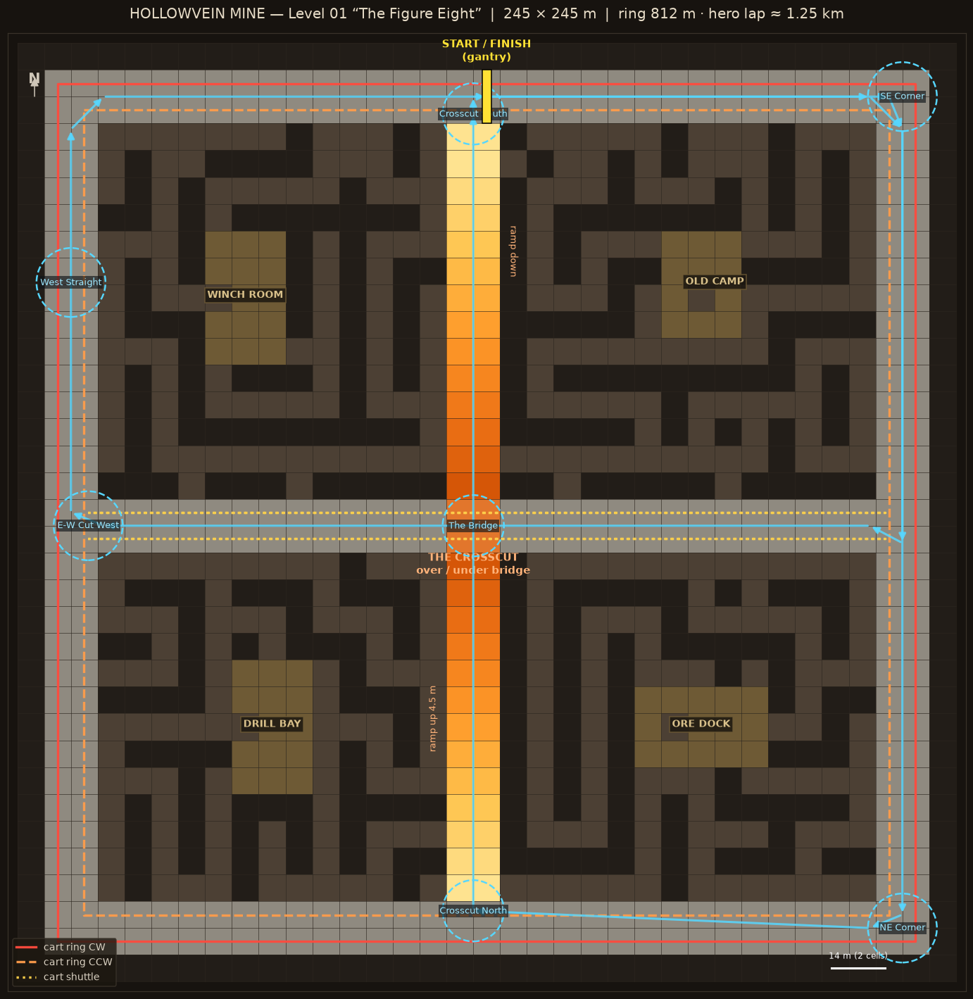
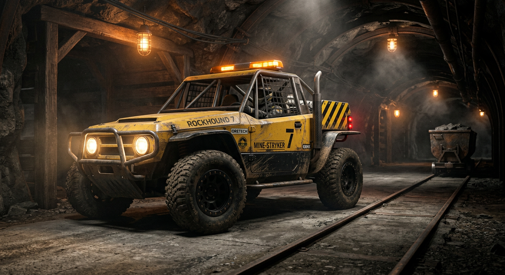
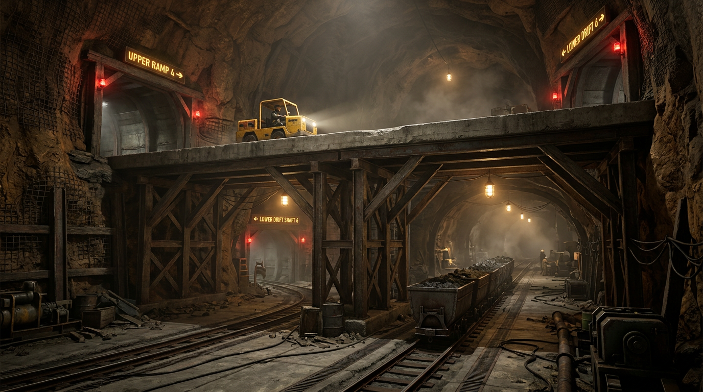

# HOLLOWVEIN MINE — Level 01 "The Figure Eight"
### Mine-racer circuit design · AAA production package

> **What this is:** a complete, verified 3D design package for a drivable mine level —
> crisscrossing maze tunnels, a road with cart-grooves (rails set into the paving),
> roof beams + hanging lights, ore carts that roam the rails like traffic, a
> figure-eight race circuit with an over/under bridge, and a drivable box car.
> Everything exists as real 3D geometry (glTF), plus an interactive viewer you can
> **drive** in the browser.

---

## 1 · The pitch

Deep inside a still-active mine, the miners' service roads have become an illegal
race circuit. The haulage carts never stopped running. Racers share the road with
them — the grooves in the paving are the carts' domain, everything between them is
yours. Cut through the maze to shave seconds, or hold the wide road and thread the
traffic. The signature moment is **The Crosscut**: the lap crosses itself, one lane
ramping up and over the other on a timber-and-steel bridge.

**Player fantasy:** scrappy box-car racing in a living, working mine.
**Core loop:** hot lap → learn cart timings → riskier shortcuts → better line → repeat.

---

## 2 · The level at a glance

| | |
|---|---|
| Footprint | 245 × 245 m (35 × 35 cells @ 7 m) |
| Open tunnel area | 794 cells (~65% of grid) |
| Road network | 2-cell-wide (14 m) main roads: outer ring + 2 crosscuts |
| Maze network | 381 narrow (7 m) braided tunnels + 4 prop chambers |
| Signature feature | **The Crosscut** — N–S ramp (+4.5 m over 91 m ≈ 5% grade) bridging over the E–W cut |
| Sprint lap (outer ring) | ~810 m |
| **Hero lap (figure-8)** | ~1.25 km, 7 gates, crosses over/under itself |
| Verticality | 2 decks at the crossing; ramp climb to +4.5 m; 6 m tunnel height (7.2 m chambers) |



**Layout logic**
- **Outer ring ("Highway Ring")** — the wide, fast, cart-trafficked road. Two cart
  tracks: outer loop runs clockwise, inner loop counter-clockwise.
- **E–W crosscut** — ground-level shortcut through the middle; a cart shuttle
  runs it end-to-end. Passes *under* the bridge.
- **N–S crosscut** — ramps up from both ring sides to bridge over the E–W cut.
  No carts up here — the reward for climbing is traffic-free tarmac and the
  overtake view of the level below.
- **Maze quadrants** — 7 m-wide timber-framed tunnels, braided (55% of dead ends
  opened into loops) so there are always at least two ways through. Darker,
  tighter, unforgiving — but 10–20% shorter than the road.
- **Chambers** — 4 rooms (Drill Bay, Ore Dock, Winch Room, Old Camp) dressed with
  ore piles, barrels, crates and a tipped cart; breathing spaces and set-dressing
  anchors.

ASCII blueprint (`#` rock, `=` ring road, `-` E–W cut, `|` N–S ramp, `X` bridge,
`.` maze, `o` chamber, `S` start):

```
###################################
#=================================#
#==.#...#.....#.||......#.......==#
#==.#.#.#.#.#.#.||#####.#.###.##==#
#==.#.#.#.#.#...||#...#.#...#...==#
#==.#.#.###.####||#.#.#.#.#####.==#
#==...#.ooo.#...||#.#.#...#.....==#
#==.####ooo.#.#.||#.#.#ooooo###.==#
#==......oo...#.||#.#.#o.ooo..#.==#
#==####.ooo.###.||#.#.#ooooo#.##==#
#==...#.ooo.#...||#.#.#...#.#...==#
#==##.#.#.###.#.||#.#.#.#####.#.==#
#==...#...#...#.||#.#...#.....#.==#
#==.###.###.###.||#.#####.#.###.==#
#==.........#...||#.............==#
#==-------------XX--------------==#
#==-------------XX--------------==#
#==###.###.#####||##.#####.#####==#
#==.#...........||..........#...==#
#==.#.#########.||#####.#.#.#.#.==#
#==.#.#.....#...||#.....#.....#.==#
#==.#.#.###.#.#.||#.#########.#.==#
#==...#ooo..#.#.||#.........#...==#
#==.###ooo#.#.#.||#####.ooo.####==#
#==.#...oo#.#.#.||#...#.o.o.....==#
#==.#.#ooo#.#.##||#.#.##ooo####.==#
#==...#ooo#.#...||#.#...ooo...#.==#
#==##.#.#######.||#.#######.#.#.==#
#==.#.#.....#...||#...#...#.#.#.==#
#==.#..####...#.||....#.#...#.#.==#
#==.......#...#.||#.....#...#...==#
#================S================#
#=================================#
###################################
```

---

## 3 · The road & the grooves (cart integration)

The main roads are **concrete service paving with two sunken grooves**, one near
each edge — exactly like tram rails in city streets. Each groove (1.5 m wide)
holds a pair of worn steel rails 0.9 m apart; rail heads sit ~2 cm proud of the
paving.

- **Groove track offsets:** ±3.4 m from road centerline → a 5.9 m drivable strip
  between the grooves, plus ~2.8 m shoulders outside them.
- **Driving on rails is allowed but punishing** — the grooves tram-line the car
  (reduced steering authority, rumble audio) so they double as a skill surface.
- **Junctions are flat crossings** — rails cross the paving square-on; the final
  art pass replaces them with spline-based switches where carts can turn.
- Wayfinding: reflective chevron signs + glowing direction boards at every
  crosscut junction.

---

## 4 · Cart traffic (the hazard)

Carts are the level's "traffic" — autonomous ore runs on fixed schedules. They are
heavy: they will not brake for you.

| Route | Type | Speed | Spawning |
|---|---|---|---|
| Ring outer track | loop, CW | 9 m/s (32 km/h) | 4 carts, even spacing |
| Ring inner track | loop, CCW | 8 m/s | 4 carts, even spacing |
| E–W cut, north track | shuttle | 7.5 m/s | 1 cart, end-to-end |
| E–W cut, south track | shuttle | 7 m/s | 1 cart, opposite phase |

**Telegraphing (AAA rules — every hazard announces itself):**
1. **Sight:** every cart carries a warm headlamp, red tail marker and amber side
   flags; rails visibly converge ahead of you.
2. **Signal posts** at every point where cart tracks cross a road junction
   (8 installed): red lamp + green lamp + warning bell. Red = cart in the
   junction within 4 s.
3. **Audio:** rail rumble + bell doppler 3–4 s before an encounter; junction
   bells double as the music of the level.
4. **Collision:** heavy sideswipe knockback + damage, not instant death. Getting
   clattered into a timber frame should feel like the mine's fault, not the
   player's.

**Race design intent:** the ring is *fast but shared*; the maze is *slow but
yours*; the bridge is *clean air as a reward for the climb*. Lap times balance
when the maze shortcut saves ~10–15% of distance at ~70% of the road's average
speed.

---

## 5 · Structure & lighting

**Roof support (reads at a glance, cheap to render):**
- **Timber frame sets** (two 0.36 m posts + header + collar) every second cell in
  narrow maze tunnels — the mine's bones.
- **Steel arch sets** (posts + roof beam + knee braces) every 32 m on main roads,
  skipped at junctions.
- **Chamber posts + tie beams** in the 4 rooms (taller 7.2 m roofs).
- **The bridge:** concrete deck on steel corner bents, twin under-beams, red
  portal lamps top and bottom.

**Lighting plan (mines are lit *by* practicals):**
| Source | Color | Spacing | Role |
|---|---|---|---|
| Hanging cage lamps (cable + cone shade) | 2700 K warm | every 7 m on roads, 35 m in maze | rhythm and depth |
| Junction floods | 5600 K cool | 8 junctions | landmark beacons |
| Bridge portal lamps | red | 8 positions | danger accent |
| Cart headlamps / signals | warm / red-green | moving | living hazard |
| Player headlights | warm white | — | the player's torch |

Warm 2700 K sodium pools every 7 m give the tunnels their strobing rhythm at
speed; fog + dust cards turn each lamp into a light gate. In-engine: baked GI for
static lamps, virtualized point lights near camera, one dynamic spotlight per
player vehicle. (The web viewer already implements the "6 nearest lamps live"
pooling.)

---

## 6 · The car — "Canary MK-2"

A box car, slightly detailed — deliberately simple volumes with just enough
dressing to read as a real vehicle:

- **Layout:** single-seat, mid-engine buggy. 3.5 m L × 1.9 m W × 1.95 m H.
- **The box:** stacked chamfered volumes — black plastic skirt, safety-yellow
  main box, inset shoulder line. One material story, instantly readable.
- **Cage:** dark steel tube roll cage (main hoop, halo bars, rear stays, door
  bars) with an **amber strobe light bar** — mine-legal, and the car's signature
  from behind.
- **Details that sell it:** bull bar + round headlights, beadlock wheels with
  chunky tread blocks, fenders, exhaust stack, spare fuel can, fire
  extinguisher, harness, dash screen, mirrors, antenna.
- **Spec:** 15,928 tris, 16 PBR materials, wheel nodes named `wheel_fl/fr/rl/rr_*`
  ready for engine-side spin/steer. ~0.3 MB.





**Handling profile (arcade-sim blend):** 31 m/s top speed, 13.5 m/s² accel,
2.35 rad/s yaw grip, handbrake drift (1.9 rad/s, heavy scrub). Suspension-tuned
for rutted concrete: stiff springs, short travel, anti-roll bars — the car should
*chatter* over the rail grooves.

---

## 7 · Verified geometry (QA)

The build scripts include automated checks — the shipped scene passes:
- **Seal test:** 3,192 horizontal rays from every open cell-deck → 0 leaks.
- **Connectivity:** all 794 open cells reachable from spawn; both bridge decks
  connect to their approaches.
- **Drivability sim:** the full 1.25 km figure-8 racing line sampled every 0.5 m
  with the car's 4-corner footprint → 0 blocks, 7/7 gates, ramp crest at 4.64 m.
- All 381 maze cells drivable; ring sprint lap clean.

---

## 8 · File manifest

```
mine-racer/
├── index.html                  ← interactive 3D viewer (start here)
├── js/                         ← self-contained three.js + bloom pipeline
├── assets/
│   ├── models/
│   │   ├── boxcar.glb          ← drivable car (16 k tris, named wheels)
│   │   ├── minecart.glb        ← traffic cart (1.8 k tris, instancing-ready)
│   │   └── mine_scene.glb      ← full level maquette (111 k tris, 33 materials)
│   ├── maps/
│   │   ├── layout_map.png      ← annotated circuit blueprint
│   │   ├── layout.json         ← machine-readable layout (viewer + engine import)
│   │   ├── layout_ascii.txt    ← ASCII blueprint
│   │   └── lamps.json          ← lamp positions (dynamic light pools)
│   ├── concept/
│   │   ├── boxcar_hero.png     ← car key art
│   │   └── crosscut_bridge.png ← the Crosscut environment concept
│   └── preview/                ← turntable stills of the car
├── docs/Mine_Racer_GDD.md      ← this document
└── tools/                      ← Python build pipeline (regenerates everything)
    ├── matlib.py               ← shared PBR material library + primitives
    ├── boxcar.py               ← builds the car
    ├── minecart.py             ← builds the cart
    ├── mine_layout.py          ← maze/circuit generator (seeded, deterministic)
    ├── mine_scene.py           ← assembles the 3D level
    ├── make_map.py             ← blueprint renderer
    └── preview_render.py       ← QA stills
```

**Run the viewer:** `cd mine-racer && python3 -m http.server 8080` →
open `http://localhost:8080`. Buttons: **Drive the mine** (WASD, dodge carts,
cyan gates in order, cross the start line for a lap), **Box car** / **Mine cart**
turntables, **Circuit map** overlay. `C` camera, `L` headlights, `R` respawn, `M` map.

**Engine import:** all assets are standard glTF 2.0 (Y-up, meters) — drop the
GLBs into Unity (glTFast) or Unreal (Interchange) as-is. `layout.json` doubles as
a level-description file: cells, decks, floors, routes, gates and spawn can drive
server-side validation or procedural dressing.

---

## 9 · Production notes (next steps to AAA)

1. **Modular kit-ification:** the maquette's straight/junction/ramp/bridge pieces
   map 1:1 to a trim-sheeted kit (7 m grid): `straight_7m`, `junction_4way`,
   `corner`, `ramp_7m`, `bridge_span_14m`, `chamber_21m`. Swap rock quads for
   sculpted tileable rock + vertex-blended concrete.
2. **LODs:** kit LOD1 at 50%, LOD2 at 25% (beams and rails become cards);
   carts instance with 3 LODs (they repeat ~10× on screen).
3. **Collision:** road splines + capsule sweeps for timber posts; the JSON grid
   already validates player movement (it powers the web demo).
4. **Dressing pass:** cable bundles, roof bolts, spillage ore along rails, tire
   marks through the racing line, cart derailment set-piece in Old Camp.
5. **Audio:** cart bell + railrumble mixer ducked by proximity; engine echo
   tightens in narrow maze cells (convolution with tunnel IR).
6. **Gameplay hooks:** gate system = respawn/checkpoint network; cart routes are
   data — schedule variants per difficulty; a "rush hour" event mode doubles
   shuttle frequency for time-attack.
